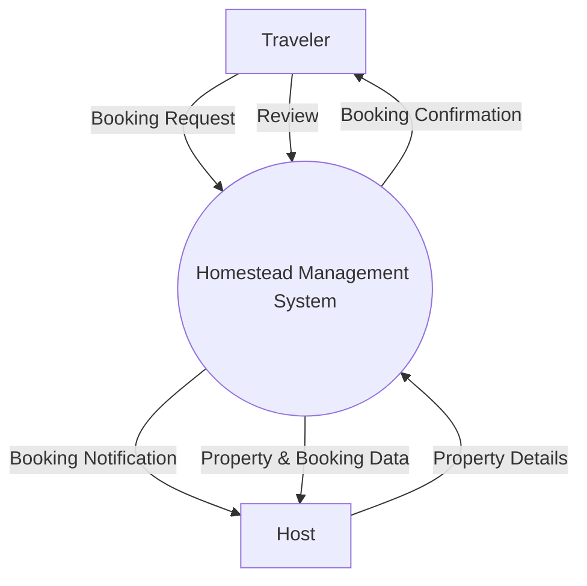
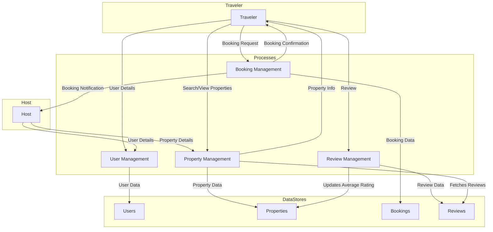

# Homestead Management System - B.Tech Project Report

## Table of Contents
1. [Introduction](#1-introduction)
2. [Project Overview](#2-project-overview)
3. [System Architecture](#3-system-architecture)
    - [3.1. Tech Stack Rationale](#31-tech-stack-rationale)
    - [3.2. Backend Architecture](#32-backend-architecture)
    - [3.3. Frontend Architecture](#33-frontend-architecture)
4. [Data Flow Diagrams (DFD)](#4-data-flow-diagrams-dfd)
    - [4.1. Level 0 DFD (Context Diagram)](#41-level-0-dfd-context-diagram)
    - [4.2. Level 1 DFD](#42-level-1-dfd)
5. [Database Schema](#5-database-schema)
    - [5.1. User Schema](#51-user-schema)
    - [5.2. Property Schema](#52-property-schema)
    - [5.3. Booking Schema](#53-booking-schema)
    - [5.4. Review Schema](#54-review-schema)
6. [API Documentation](#6-api-documentation)
    - [6.1. Authentication (`/api/auth`)](#61-authentication-apiauth)
    - [6.2. Properties (`/api/properties`)](#62-properties-apiproperties)
    - [6.3. Bookings (`/api/bookings`)](#63-bookings-apibookings)
7. [Conclusion](#7-conclusion)

---

## 1. Introduction

The Homestead Management System is a full-stack web application designed to bridge the gap between travelers seeking authentic experiences and hosts offering unique homestays in offbeat locations. This project aims to provide a seamless, secure, and user-friendly platform for booking and managing these properties, with a special focus on promoting sustainable and responsible tourism. This document provides a comprehensive overview of the project, its architecture, design, and implementation details, suitable for a B.Tech final year project submission.

## 2. Project Overview

**Homestead Management System** is a modern booking and management platform for unique and offbeat homestays. It connects travelers seeking authentic experiences with hosts in rural and less-traveled locations.

### Features

-   **For Travelers:**
    -   Explore a curated list of unique homestays.
    -   Filter properties by location, price, amenities, and more.
    -   View detailed property information, including images and reviews.
    -   Book stays securely and manage upcoming reservations.
-   **For Hosts:**
    -   A dedicated dashboard to manage properties and bookings.
    -   Full CRUD (Create, Read, Update, Delete) functionality for property listings.
    -   View and manage incoming booking requests.
-   **Secure Authentication:**
    -   JWT-based authentication with password hashing (bcrypt).
    -   Role-based access control (Traveler, Host, Admin) to protect routes and actions.

---

## 3. System Architecture

The application is built using the MERN stack (MongoDB, Express, React, Node.js), chosen for its robustness, scalability, and rapid development capabilities.

### 3.1. Tech Stack Rationale

-   **Node.js & Express:** Provides a fast, scalable, and lightweight backend, perfect for building RESTful APIs.
-   **MongoDB & Mongoose:** A NoSQL database that offers flexibility and scalability. Mongoose provides schema validation and business logic hooks.
-   **React & Vite:** A powerful combination for building modern, fast, and interactive user interfaces.
-   **Tailwind CSS:** A utility-first CSS framework that enables rapid UI development.
-   **JWT (JSON Web Tokens):** Enables stateless and secure authentication.

### 3.2. Backend Architecture

The backend follows a layered architecture to ensure separation of concerns.

```
backend/
├── src/
│   ├── config/             # Database connection
│   ├── controllers/        # Business logic
│   ├── middlewares/        # Auth, error handling
│   ├── models/             # Mongoose schemas
│   └── routes/             # API routes
└── server.js               # Server entry point
```

### 3.3. Frontend Architecture

The frontend is structured for modularity and scalability.

```
frontend/
├── src/
│   ├── components/         # Reusable UI components
│   ├── context/            # Global state (AuthContext)
│   ├── pages/              # Application pages
│   ├── routes/             # Routing configuration
│   └── services/           # API services
└── vite.config.js
```

---

## 4. Data Flow Diagrams (DFD)

### 4.1. Level 0 DFD (Context Diagram)



### 4.2. Level 1 DFD



---

## 5. Database Schema

### 5.1. User Schema (`User.js`)

```javascript
const userSchema = new mongoose.Schema({
  name: { type: String, required: true, trim: true },
  email: { type: String, required: true, unique: true, trim: true, lowercase: true },
  password: { type: String, required: true },
  role: { type: String, enum: ['Traveler', 'Host', 'Admin'], default: 'Traveler' },
}, { timestamps: true });
```

### 5.2. Property Schema (`Property.js`)

```javascript
const propertySchema = new mongoose.Schema({
  hostId: { type: mongoose.Schema.Types.ObjectId, ref: 'User', required: true },
  title: { type: String, required: true, trim: true },
  description: { type: String, required: true },
  location: {
    address: { type: String, required: true },
    city: { type: String, required: true },
    country: { type: String, required: true },
  },
  pricePerNight: { type: Number, required: true },
  amenities: [{ type: String }],
  maxGuests: { type: Number, required: true },
  images: [{ type: String }],
  averageRating: { type: Number, default: 0 },
}, { timestamps: true });
```

### 5.3. Booking Schema (`Booking.js`)

```javascript
const bookingSchema = new mongoose.Schema({
  travelerId: { type: mongoose.Schema.Types.ObjectId, ref: 'User', required: true },
  propertyId: { type: mongoose.Schema.Types.ObjectId, ref: 'Property', required: true },
  hostId: { type: mongoose.Schema.Types.ObjectId, ref: 'User', required: true },
  startDate: { type: Date, required: true },
  endDate: { type: Date, required: true },
  totalPrice: { type: Number, required: true },
  status: { type: String, enum: ['Pending', 'Confirmed', 'Cancelled', 'Completed'], default: 'Pending' },
}, { timestamps: true });
```

### 5.4. Review Schema (`Review.js`)

```javascript
const reviewSchema = new mongoose.Schema({
  userId: { type: mongoose.Schema.Types.ObjectId, ref: 'User', required: true },
  propertyId: { type: mongoose.Schema.Types.ObjectId, ref: 'Property', required: true },
  rating: { type: Number, required: true, min: 1, max: 5 },
  comment: { type: String, required: true },
}, { timestamps: true });
```

---

## 6. API Documentation

### 6.1. Authentication (`/api/auth`)

-   `POST /signup`: Register a new user.
-   `POST /login`: Authenticate a user and receive a JWT.

### 6.2. Properties (`/api/properties`)

-   `GET /`: Get all listed properties.
-   `GET /:id`: Get a single property by ID.
-   `POST /`: Create a new property (Host/Admin only).
-   `PUT /:id`: Update a property (Host/Admin only).
-   `DELETE /:id`: Delete a property (Host/Admin only).

### 6.3. Bookings (`/api/bookings`)

-   `POST /`: Create a new booking (Traveler only).
-   `GET /user`: Get all bookings for the logged-in traveler.
-   `GET /host`: Get all bookings for the logged-in host.
-   `PUT /:id/cancel`: Cancel a booking.

---

## 7. Conclusion

The Homestead Management System successfully demonstrates the development of a modern, full-stack web application using the MERN stack. The project adheres to best practices in software architecture, including separation of concerns, modular design, and secure authentication. The resulting platform is a robust and scalable solution for the niche market of homestay bookings, providing a valuable service to both travelers and hosts. This project showcases a comprehensive understanding of modern web development technologies and principles.
