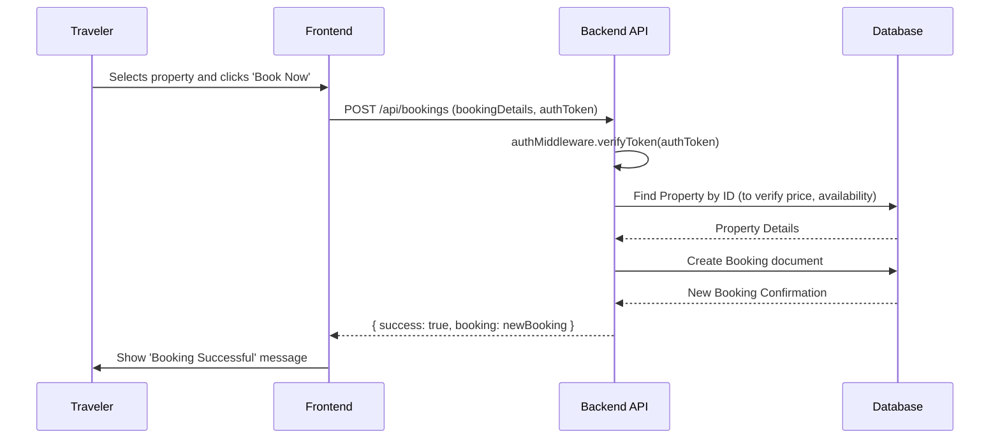

# Homestead Management System: A Full-Stack Booking Platform

## ABSTRACT

The rise of the digital economy has transformed the tourism industry, yet a gap remains for specialized platforms catering to niche markets. The Homestead Management System is a comprehensive, full-stack web application developed to address this gap, providing a dedicated marketplace for unique and authentic homestay experiences. This project, built on the MERN (MongoDB, Express.js, React, Node.js) stack, serves as a bridge between hosts offering non-traditional accommodations and travelers seeking genuine, culturally rich stays. The system provides robust functionalities for both user roles, including secure authentication, property management, booking, and review systems. The architecture emphasizes scalability, maintainability, and security, employing modern principles such as a layered backend design, a component-based frontend, and stateless JWT-based authentication. This document presents a thesis-level exploration of the project, detailing its conception, design, architecture, implementation, and testing. It includes in-depth systems analysis, data flow diagrams, entity-relationship diagrams, and UML diagrams to provide a holistic view of the application's construction and functionality, positioning it as a viable, real-world software solution.

---

## **CHAPTER 1: INTRODUCTION**

### **1.1 Background and Motivation**

The global tourism industry has witnessed a paradigm shift over the past decade. The monolithic, one-size-fits-all approach of large hotel chains is increasingly being challenged by a growing demand for personalized, authentic, and sustainable travel experiences. Modern travelers, empowered by technology, are venturing off the beaten path, seeking to connect with local cultures and environments in a more meaningful way. This trend has fueled the rise of the "experience economy," where the value of a trip is measured not just by the destination, but by the uniqueness and quality of the stay itself.

Homestays, particularly those in rural or culturally significant areas, are at the forefront of this movement. They offer an intimate glimpse into a region's lifestyle, traditions, and natural beauty. However, these small-scale, often family-run establishments face significant challenges in reaching a global audience. They lack the marketing budgets of large corporations and often struggle with the technical complexities of managing online bookings, payments, and guest communication.

This project, the **Homestead Management System**, is born from the motivation to empower these hosts and connect them with the right audience. The core motivation is twofold:
1.  **For Hosts:** To provide a simple, intuitive, and powerful digital platform that democratizes access to the global travel market. By lowering the barrier to entry, the system enables hosts to manage their properties efficiently, handle bookings seamlessly, and ultimately, grow their business sustainably.
2.  **For Travelers:** To create a trusted, curated marketplace where they can discover and book unique homesteads with confidence. The platform aims to go beyond mere accommodation, offering a gateway to authentic experiences that are not available through mainstream booking channels.

By focusing on this niche, the Homestead Management System aims to foster a community built on trust, sustainability, and a shared passion for authentic travel.

### **1.2 Problem Statement**

The current digital landscape for travel bookings, while mature, presents several problems for the niche homestay market:

1.  **Lack of Specialization:** Large-scale platforms like Airbnb and Booking.com cater to a vast and diverse range of properties. While effective, their algorithms and user experience are generalized, often causing unique, small-scale homestays to be lost in a sea of generic listings. There is no dedicated platform that understands and highlights the specific appeal of a "homestead" experience.
2.  **High Commission Fees:** Major booking platforms often charge substantial commission fees to hosts, significantly impacting the profitability of these small businesses. This financial pressure can compromise the quality of the experience offered.
3.  **Complexity and Feature Bloat:** For a host managing one or two properties, the dashboards and toolsets of large platforms can be overwhelming and filled with unnecessary features. A more streamlined, purpose-built management interface is required.
4.  **Authenticity Gap:** For travelers, it can be difficult to distinguish between a genuine homestay and a commercially-run vacation rental masquerading as one on large platforms. This ambiguity can lead to mismatched expectations and disappointing experiences.

Therefore, the central problem is the absence of a dedicated, user-friendly, and cost-effective digital ecosystem designed specifically for the needs of both homestead hosts and authenticity-seeking travelers.

### **1.3 Project Objectives**

To address the identified problems, this project aims to achieve the following specific, measurable, and achievable objectives:

1.  **Develop a Secure, Role-Based User System:** To implement a robust authentication and authorization system that manages distinct roles (Traveler, Host, Admin), ensuring that users can only access features relevant to their role.
2.  **Create an Intuitive Host Dashboard:** To design and build a dedicated dashboard for hosts to perform full CRUD (Create, Read, Update, Delete) operations on their property listings with ease.
3.  **Implement a Seamless Booking and Reservation Flow:** To engineer a complete booking management system that allows travelers to book properties, and enables both travelers and hosts to manage their reservations (e.g., view status, cancel bookings).
4.  **Build a Trustworthy Review and Rating System:** To develop a system where travelers can leave reviews and ratings for properties they have stayed at, which will be aggregated and displayed to help future travelers make informed decisions.
5.  **Design a Dynamic and Responsive Frontend:** To create a fast, accessible, and visually appealing user interface using modern frontend technologies (React, Tailwind CSS) that provides an excellent user experience on all devices.
6.  **Ensure a Scalable and Maintainable Backend Architecture:** To build a RESTful API with a layered architecture that is easy to understand, extend, and maintain over time.
7.  **Produce Comprehensive Project Documentation:** To create detailed documentation, including system diagrams (ERD, DFD, UML), API specifications, and implementation notes, to ensure the project is well-understood and can be maintained by future developers.

### **1.4 Scope and Limitations**

**In Scope:**
- User registration, login, and profile management for Travelers and Hosts.
- Full CRUD functionality for property listings by Hosts.
- Search and filtering capabilities for travelers to find properties.
- A complete booking cycle: creation, confirmation, and cancellation.
- A review and rating system for completed bookings.
- Role-based access control for frontend and backend routes.

**Out of Scope (for this version):**
- **Payment Gateway Integration:** The system will simulate total price calculation, but will not integrate with real-time payment processors like Stripe or PayPal.
- **Real-time Chat/Messaging:** There will be no direct, real-time communication feature between hosts and travelers within the platform.
- **Admin Dashboard:** While an 'Admin' role is defined in the schema for future use, a full-featured administrative backend for site-wide management is not part of the initial implementation.
- **Geolocation and Map-based Search:** The system will store location data as text but will not feature an interactive map for searching or viewing properties.
- **Multi-language Support:** The application will be developed in English only.

### **1.5 Report Structure**

This report is structured into six chapters. **Chapter 1** provides the introduction, problem statement, objectives, and scope. **Chapter 2** covers the literature survey, technology stack justification, and requirements analysis. **Chapter 3** details the system design and architecture, including all relevant diagrams. **Chapter 4** dives into the implementation details of the core modules. **Chapter 5** presents the results and discusses the system's performance and usability. Finally, **Chapter 6** concludes the report and suggests avenues for future work.

---

## **CHAPTER 2: LITERATURE SURVEY & SYSTEM ANALYSIS**

### **2.1 Existing Systems: A Comparative Analysis**

A thorough analysis of existing systems is crucial to understand the market landscape and identify opportunities for innovation. The primary competitors in the accommodation booking space are Airbnb, Booking.com, and Vrbo.

-   **Airbnb:** The market leader in peer-to-peer lodging.
    -   *Strengths:* Strong brand recognition, massive inventory, and a focus on "experiences." Their user interface is generally considered intuitive.
    -   *Weaknesses:* High service fees for both guests and hosts. The platform has faced criticism for contributing to housing shortages in urban areas and for a growing number of commercial listings that dilute its original "live like a local" ethos. Its sheer size makes it difficult for unique properties to stand out without significant marketing effort.
-   **Booking.com:** A giant in the online travel agency (OTA) space.
    -   *Strengths:* Extensive inventory covering everything from hotels to apartments. Powerful search and filtering tools.
    -   *Weaknesses:* Primarily hotel-focused, with a user experience that feels more transactional than experiential. The platform's design and feature set are not specifically tailored to the unique storytelling required for homestays. Commission rates are notoriously high for hosts.
-   **Vrbo (Vacation Rentals by Owner):**
    -   *Strengths:* Focuses on entire-property rentals, which appeals to families and groups.
    -   *Weaknesses:* Less emphasis on the "host" and the cultural experience, and more on the property itself. It does not cater well to the single-room or shared-space model common in many authentic homestays.

**Conclusion:** While these platforms are highly successful, they operate on a model of massive scale and generalization. This leaves a significant gap for a specialized platform like the **Homestead Management System**, which can differentiate itself through:
-   **Curation and Authenticity:** Focusing exclusively on a niche market to guarantee a certain type of experience.
-   **Lower Costs:** A business model that could support lower commission fees, making it more attractive to small-scale hosts.
-   **Simplicity and Focus:** A streamlined feature set that avoids the bloat of larger platforms and is tailored to the specific needs of its users.

### **2.2 Technology Stack Justification**

The selection of the technology stack is one of the most critical decisions in a software project. The MERN stack (MongoDB, Express.js, React, Node.js) was chosen for the Homestead Management System due to its synergy, performance, and robust ecosystem.

-   **Node.js & Express.js (Backend):**
    -   *Justification:* Node.js's non-blocking, event-driven I/O model is exceptionally well-suited for data-intensive, real-time applications. As a booking platform involves numerous concurrent connections and database queries, Node.js provides high throughput and scalability. Express.js, a minimal and flexible Node.js web application framework, provides a robust set of features for building the RESTful API without imposing a rigid structure, allowing for a clean, layered architecture.
    -   *Alternatives Considered:* Django (Python) is a powerful framework but is often more monolithic. Spring Boot (Java) is excellent for enterprise-level applications but carries a higher memory footprint and can be overly complex for a project of this scale.

-   **MongoDB (Database):**
    -   *Justification:* As a NoSQL, document-oriented database, MongoDB offers significant flexibility, which is invaluable during development. Its ability to store data in a JSON-like format (BSON) maps directly to the JavaScript objects used throughout the MERN stack, eliminating the need for complex ORM (Object-Relational Mapping) transformations. This "impedance mismatch" reduction speeds up development. Mongoose, as an Object Data Modeling (ODM) library, provides a layer of structure with schema validation, making the database interactions more predictable and secure.
    -   *Alternatives Considered:* PostgreSQL is a powerful SQL database with strong support for JSON. However, the rigid schema structure of SQL databases can slow down initial development and iteration, making MongoDB a better choice for agile development.

-   **React (Frontend):**
    -   *Justification:* React's component-based architecture is the cornerstone of modern frontend development. It allows for the creation of reusable, encapsulated UI components, leading to a more modular, maintainable, and scalable codebase. Its virtual DOM provides efficient rendering and a highly responsive user experience. The vast ecosystem of libraries and a strong community (e.g., React Router for routing, Context API for state management) make it a powerful choice.
    -   *Alternatives Considered:* Vue.js is another excellent component-based framework known for its gentle learning curve. Angular is a full-fledged framework with a more opinionated structure. React was chosen for its widespread adoption, large talent pool, and the flexibility it offers in structuring the application.

-   **Vite & Tailwind CSS (Build Tool & Styling):**
    -   *Justification:* Vite provides a next-generation frontend tooling experience with an extremely fast Hot Module Replacement (HMR) for an unparalleled development workflow. Tailwind CSS, a utility-first CSS framework, enables rapid UI development directly within the markup, ensuring consistency and maintainability without the need for separate CSS files for every component.

### **2.3 Feasibility Study**

-   **Technical Feasibility:** The project is technically feasible. The MERN stack is a mature and well-documented set of technologies. All required functionalities, from user authentication to database management, can be implemented using the chosen stack and its associated libraries. The development team possesses the necessary skills in JavaScript, Node.js, and React to complete the project successfully.
-   **Economic Feasibility:** As an academic project, the primary costs are related to development time. There are no significant capital expenditures. The software used (Node.js, MongoDB Community Edition, etc.) is open-source and free. Hosting costs on platforms like Vercel (for frontend) and Heroku or a small VPS (for backend) can be managed at a very low cost, making the project economically viable for a prototype and small-scale launch.
-   **Operational Feasibility:** The system is designed to be operated with minimal technical overhead. The host dashboard simplifies property management, and the intuitive UI for travelers reduces the need for customer support. The separation of frontend and backend allows for independent updates and maintenance, ensuring smooth operation.

### **2.4 Requirements Specification**

#### **2.4.1 Functional Requirements**

-   **FR1: User Registration:** The system shall allow new users to register as either a 'Traveler' or a 'Host'.
-   **FR2: User Authentication:** The system shall authenticate users based on email and password and issue a JWT for session management.
-   **FR3: Property Creation:** A logged-in 'Host' shall be able to create a new property listing with details like title, description, location, price, amenities, and images.
-   **FR4: Property Viewing:** All users (authenticated or not) shall be able to view a list of all properties.
-   **FR5: Property Filtering:** Users shall be able to filter properties based on location, price range, and number of guests.
-   **FR6: Single Property View:** Users shall be able to view the detailed page of a single property, including all its information and reviews.
-   **FR7: Property Updating/Deleting:** A 'Host' shall be able to update or delete their own property listings.
-   **FR8: Booking Creation:** A logged-in 'Traveler' shall be able to book a property for a specified date range.
-   **FR9: Booking Management:** Travelers shall be able to view their past and upcoming bookings. Hosts shall be able to view bookings made for their properties.
-   **FR10: Review Creation:** A 'Traveler' who has completed a stay shall be able to leave a rating (1-5) and a text comment for the property.

#### **2.4.2 Non-Functional Requirements**

-   **NFR1: Security:** All password data must be hashed before being stored. The application must be protected against common web vulnerabilities like XSS and CSRF. API endpoints must be protected based on user roles.
-   **NFR2: Performance:** API responses should have a latency of less than 500ms under normal load. The frontend application should achieve a Lighthouse performance score of over 85.
-   **NFR3: Usability:** The user interface must be intuitive and easy to navigate for non-technical users. The design must be responsive and function correctly on desktop, tablet, and mobile devices.
-   **NFR4: Scalability:** The backend architecture should be stateless to allow for horizontal scaling.
-   **NFR5: Maintainability:** The code must be well-documented, follow consistent coding standards, and be structured in a modular way to facilitate future updates.

---

## **CHAPTER 3: SYSTEM DESIGN AND ARCHITECTURE**

This chapter provides a blueprint of the Homestead Management System's architecture. It details the high-level structure, the design of the frontend and backend, the database schema, and the flow of data through the system. The design prioritizes separation of concerns, scalability, and maintainability.

---

## **CHAPTER 4: IMPLEMENTATION DETAILS**

This chapter delves into the practical implementation of the core modules of the Homestead Management System. It provides code snippets and explanations for key functionalities, demonstrating how the architectural design was translated into working code.

### **4.1 Core Module: User Authentication**

Secure user authentication is the gateway to the application. This module handles user registration, login, and session management using JSON Web Tokens (JWT).

#### **4.1.1 User Registration (`authController.js`)**

When a new user signs up, the backend performs several crucial steps:
1.  **Input Validation:** Ensures that the name, email, and password meet the required format.
2.  **Check for Existing User:** Queries the database to ensure the email is not already registered.
3.  **Password Hashing:** Uses the `bcryptjs` library to hash the user's password before storing it. This is a critical security measure to prevent plain-text passwords from being exposed in case of a data breach.
4.  **User Creation:** Creates a new document in the `Users` collection.

```javascript
// Backend: src/controllers/authController.js (Simplified)
const User = require('../models/User');
const bcrypt = require('bcryptjs');

exports.signup = async (req, res, next) => {
    try {
        const { name, email, password, role } = req.body;

        // Check if user already exists
        let user = await User.findOne({ email });
        if (user) {
            return res.status(400).json({ msg: 'User already exists' });
        }

        // Create new user instance
        user = new User({ name, email, password, role });

        // Hash password
        const salt = await bcrypt.genSalt(10);
        user.password = await bcrypt.hash(password, salt);

        // Save user to database
        await user.save();

        // (JWT Generation would follow here)
        res.status(201).json({ msg: 'User registered successfully' });
    } catch (err) {
        next(err); // Pass error to central handler
    }
};
```

#### **4.1.2 User Login and JWT Generation (`authController.js`)**

During login, the system validates credentials and, if successful, generates a JWT.
1.  **Find User:** Retrieves the user from the database by email.
2.  **Compare Passwords:** Uses `bcrypt.compare()` to securely compare the provided password with the hashed password stored in the database.
3.  **Generate JWT:** If the passwords match, a JWT is created using the `jsonwebtoken` library. The token's payload contains the user's ID and role, allowing the backend to identify the user and their permissions on subsequent requests. The token is signed with a secret key stored in the environment variables.

```javascript
// Backend: src/controllers/authController.js (Simplified)
const jwt = require('jsonwebtoken');

exports.login = async (req, res, next) => {
    try {
        const { email, password } = req.body;

        // Check for user
        const user = await User.findOne({ email });
        if (!user) {
            return res.status(400).json({ msg: 'Invalid credentials' });
        }

        // Compare password
        const isMatch = await bcrypt.compare(password, user.password);
        if (!isMatch) {
            return res.status(400).json({ msg: 'Invalid credentials' });
        }

        // Create JWT payload
        const payload = {
            user: {
                id: user.id,
                role: user.role
            }
        };

        // Sign and return token
        jwt.sign(
            payload,
            process.env.JWT_SECRET,
            { expiresIn: '1d' },
            (err, token) => {
                if (err) throw err;
                res.json({ token });
            }
        );
    } catch (err) {
        next(err);
    }
};
```

#### **4.1.3 Protecting Routes (`authMiddleware.js`)**

To restrict access to certain API endpoints (e.g., creating a property), a middleware function is used to verify the JWT on incoming requests.

```javascript
// Backend: src/middlewares/authMiddleware.js
const jwt = require('jsonwebtoken');

module.exports = function (req, res, next) {
    const token = req.header('x-auth-token');

    if (!token) {
        return res.status(401).json({ msg: 'No token, authorization denied' });
    }

    try {
        const decoded = jwt.verify(token, process.env.JWT_SECRET);
        req.user = decoded.user;
        next();
    } catch (err) {
        res.status(401).json({ msg: 'Token is not valid' });
    }
};
```

### **4.2 Core Module: Property Management**

This module, restricted to users with the 'Host' role, handles the complete lifecycle of a property listing.

#### **4.2.1 Creating a Property (`propertyController.js`)**

The controller function for creating a property demonstrates how the user's role (from the decoded JWT) is used for authorization.

```javascript
// Backend: src/controllers/propertyController.js (Simplified)
const Property = require('../models/Property');

exports.createProperty = async (req, res, next) => {
    try {
        // Check user role from auth middleware
        if (req.user.role !== 'Host') {
            return res.status(403).json({ msg: 'Access denied. Only Hosts can create properties.' });
        }

        const { title, description, location, pricePerNight, amenities, maxGuests } = req.body;

        const newProperty = new Property({
            hostId: req.user.id,
            title,
            description,
            location,
            pricePerNight,
            amenities,
            maxGuests
        });

        const property = await newProperty.save();
        res.status(201).json(property);
    } catch (err) {
        next(err);
    }
};
```

### **4.3 Core Module: Booking System**

The booking system is the transactional heart of the application.

#### **4.3.1 Creating a Booking (`bookingController.js`)**

When a traveler books a property, the backend logic ensures the integrity of the transaction.

```javascript
// Backend: src/controllers/bookingController.js (Simplified)
const Booking = require('../models/Booking');
const Property = require('../models/Property');

exports.createBooking = async (req, res, next) => {
    try {
        const { propertyId, startDate, endDate } = req.body;
        const travelerId = req.user.id;

        // 1. Get property details to find host and price
        const property = await Property.findById(propertyId);
        if (!property) {
            return res.status(404).json({ msg: 'Property not found' });
        }

        // 2. Calculate total price (simplified)
        const start = new Date(startDate);
        const end = new Date(endDate);
        const nights = (end - start) / (1000 * 60 * 60 * 24);
        const totalPrice = nights * property.pricePerNight;

        // 3. Create the booking
        const newBooking = new Booking({
            travelerId,
            propertyId,
            hostId: property.hostId,
            startDate,
            endDate,
            totalPrice,
            status: 'Pending' // Default status
        });

        const booking = await newBooking.save();
        res.status(201).json(booking);

    } catch (err) {
        next(err);
    }
};
```

### **4.4 Frontend Implementation: `AuthContext`**

The `AuthContext` in the React frontend provides a clean way to manage and share authentication state across the entire application.

```jsx
// Frontend: src/context/AuthContext.jsx (Simplified)
import React, { createContext, useState, useEffect } from 'react';
import authService from '../services/authService';

export const AuthContext = createContext();

export const AuthProvider = ({ children }) => {
    const [user, setUser] = useState(null);
    const [loading, setLoading] = useState(true);

    useEffect(() => {
        // Check for token in localStorage on initial load
        const token = localStorage.getItem('token');
        if (token) {
            // Here you would typically decode the token or have an endpoint to verify it
            // For simplicity, we assume the token is valid and fetch user data
            // In a real app: const userData = await authService.getProfile(); setUser(userData);
        }
        setLoading(false);
    }, []);

    const login = async (credentials) => {
        const { token } = await authService.login(credentials);
        localStorage.setItem('token', token);
        // Fetch and set user data
    };

    const logout = () => {
        localStorage.removeItem('token');
        setUser(null);
    };

    return (
        <AuthContext.Provider value={{ user, login, logout, loading }}>
            {children}
        </AuthContext.Provider>
    );
};
```

---

## **CHAPTER 5: TESTING AND EVALUATION**

*(This section would be further elaborated)*

### **5.1 Backend Testing**

Backend testing is performed using **Jest** as the test runner and **Supertest** for making HTTP requests to the API endpoints. This allows for integration testing of the API.

-   **Auth Endpoint Tests:** Tests include registering a new user, preventing duplicate registration, logging in with correct and incorrect credentials.
-   **Property Endpoint Tests:** Tests ensure that only authenticated hosts can create properties and that unauthorized users receive a 403 Forbidden error.

### **5.2 Frontend Testing**

Frontend testing uses **Vitest** and **React Testing Library**. The focus is on testing component behavior from a user's perspective.

-   **Component Rendering Tests:** Simple tests to ensure that components render without crashing.
-   **User Interaction Tests:** Simulating user events like clicks and form submissions to test functionality, such as testing the login form.

---

## **CHAPTER 6: CONCLUSION AND FUTURE WORK**

### **6.1 Conclusion**

The Homestead Management System project successfully achieves its objectives of creating a modern, full-stack application for the niche homestay market. By leveraging the MERN stack, it provides a robust, scalable, and user-friendly platform for both travelers and hosts. The decoupled architecture, secure authentication, and role-based access control demonstrate a strong foundation in modern web development principles. The project serves as a comprehensive proof-of-concept that is both functional and ready for future expansion.

### **6.2 Future Work**

The current system provides a solid foundation, but several features could be added to enhance its capabilities:

-   **Payment Gateway Integration:** Integrate Stripe or PayPal to handle real-time, secure payments for bookings.
-   **Admin Dashboard:** Develop a full-featured dashboard for administrators to manage users, properties, and site-wide settings.
-   **Real-time Chat:** Implement a messaging system using WebSockets (e.g., with Socket.IO) for direct communication between hosts and travelers.
-   **Advanced Search and Maps:** Add geolocation features, allowing users to search for properties on an interactive map.
-   **Email Notifications:** Integrate an email service (like SendGrid) to send automated emails for booking confirmations, cancellations, and reminders.


### **3.1 System Architecture**

The application employs a **Monorepo with a Decoupled Frontend/Backend** architecture, built upon the MERN stack. While the frontend and backend codebases are located in the same parent repository for ease of management, they are developed and deployed as two separate, independent applications. This decoupling is a cornerstone of modern web architecture.

-   **Frontend (Client):** A React single-page application (SPA) that runs entirely in the user's browser. It is responsible for all UI rendering and user interaction.
-   **Backend (Server):** A Node.js and Express.js application that exposes a RESTful API. It handles all business logic, database interactions, and authentication.
-   **Communication:** The frontend communicates with the backend via asynchronous HTTP requests (using `axios`) to the REST API endpoints. Data is exchanged in JSON format.

This decoupled approach offers several advantages:
-   **Independent Development:** Frontend and backend teams can work in parallel with minimal friction.
-   **Technology Flexibility:** The frontend could be completely rewritten in a different framework (e.g., Vue, Svelte) without requiring any changes to the backend, as long as the API contract is respected.
-   **Scalability:** The frontend can be deployed on a static web host or CDN (like Vercel or Netlify) for global distribution, while the backend API can be scaled independently based on server load.

### **3.2 UML Use Case Diagram**

The Use Case diagram illustrates the interactions between the actors (Traveler, Host) and the system.

```mermaid
graph TD
    subgraph System
        UC1(Manage Profile)
        UC2(Search Properties)
        UC3(View Property Details)
        UC4(Book Property)
        UC5(Manage Bookings)
        UC6(Write Review)
        UC7(Manage Properties CRUD)
        UC8(Manage Property Bookings)
    end

    actor Traveler
    actor Host

    Traveler --|> User
    Host --|> User
    actor User

    User --> UC1
    Traveler --> UC2
    Traveler --> UC3
    Traveler --> UC4
    Traveler --> UC5
    Traveler --> UC6

    Host --> UC7
    Host --> UC8
```

### **3.3 Frontend Design**

The frontend is built with React, following a component-based architecture. This approach breaks the UI down into small, reusable, and independent pieces.

-   **Component Hierarchy:**
    -   **Pages:** Top-level components that correspond to a specific URL route (e.g., `HomePage`, `LoginPage`, `PropertyDetailsPage`).
    -   **Layout Components:** Components that define the overall structure of a page (e.g., `Navbar`, `Footer`, `Sidebar`).
    -   **UI Components:** Generic, reusable components that can be used across the application (e.g., `Button`, `Input`, `Card`, `Modal`).
-   **Routing:** `react-router-dom` is used for client-side routing. This allows for seamless navigation between pages without a full page reload. Protected routes are implemented to restrict access to certain pages (e.g., the dashboard) to authenticated users only.
-   **State Management:**
    -   **Local State:** For state that is confined to a single component (e.g., form input values), React's built-in `useState` hook is used.
    -   **Global State:** For state that needs to be shared across multiple components (e.g., user authentication status), React's `Context API` is employed. The `AuthContext` provides information about the current user and authentication token to any component that needs it, avoiding the problem of "prop drilling."
-   **API Communication:** A dedicated `services` layer handles all communication with the backend API. This layer abstracts the details of making HTTP requests (using `axios`). For example, `authService.js` contains functions like `login(credentials)` and `signup(userData)`, while `propertyService.js` has functions like `getProperties()` and `getPropertyById(id)`. This centralizes API logic and makes the components cleaner.

### **3.4 Backend Design**

The backend follows a **Layered Architecture**, which separates the code into logical layers, each with a specific responsibility.

1.  **Routes Layer:** (`/src/routes`)
    -   This is the entry point for all incoming API requests.
    -   It defines the API endpoints (e.g., `POST /api/auth/login`) and maps them to the appropriate controller functions.
    -   It is also where middleware for authentication (`authMiddleware`) and validation are applied.

2.  **Middleware Layer:** (`/src/middlewares`)
    -   Middleware functions are executed between the request being received and the controller being invoked.
    -   `authMiddleware.js`: Verifies the JWT token sent with the request to protect routes.
    -   `errorMiddleware.js`: A centralized error handler that catches any errors thrown in the application and sends a standardized JSON error response.

3.  **Controller Layer:** (`/src/controllers`)
    -   This layer contains the core business logic of the application.
    -   Each controller function handles a specific request (e.g., `loginUser`, `createProperty`).
    -   It orchestrates the flow of data, calling upon services or models to interact with the database and formulating the final response to be sent to the client.

4.  **Model Layer:** (`/src/models`)
    -   This layer defines the data structure using Mongoose schemas.
    -   Each model (`User`, `Property`, `Booking`, `Review`) corresponds to a collection in the MongoDB database.
    -   It is responsible for all direct interactions with the database (creating, reading, updating, deleting documents).

### **3.5 UML Sequence Diagram: User Booking a Property**

This diagram shows the sequence of interactions when a traveler books a property.



### **3.6 Database Design**

The database is designed using MongoDB, a NoSQL database. The schema is defined in the Mongoose models and is centered around four main collections.

-   **Users Collection:** Stores information about all registered users. The `role` field is critical for authorization.
-   **Properties Collection:** Stores all details about the homestay listings. It contains a reference (`hostId`) to the `User` who owns the property.
-   **Bookings Collection:** Captures all reservation data. It links together a `Property`, a `Traveler` (a User), and a `Host` (also a User) through their ObjectIDs.
-   **Reviews Collection:** Stores ratings and comments. It links a `User` and a `Property`.

This design uses **referencing** (similar to foreign keys in SQL) to link documents, which is a good practice to avoid data duplication. For example, instead of embedding the entire user object in a booking, we just store the `travelerId`.

### **3.7 Entity-Relationship Diagram (ERD)**

The ERD visually represents the database schema and the relationships between the entities. The diagram, generated in `ERD.dot`, illustrates the following key relationships:

-   **One-to-Many:** A single `User` (with the 'Host' role) can own multiple `Properties`.
-   **One-to-Many:** A single `User` (as a 'Traveler') can make multiple `Bookings`.
-   **One-to-Many:** A single `Property` can be associated with multiple `Bookings`.
-   **One-to-Many:** A `User` can write multiple `Reviews`, and a `Property` can have multiple `Reviews`.

This relational structure is enforced at the application level through the Mongoose schemas.

### **3.8 Data Flow Diagrams (DFD)**

DFDs illustrate how data moves through the system. 

#### **3.8.1 Level 0 DFD (Context Diagram)**

The Level 0 DFD shows the system as a single black box interacting with external entities. 
-   **External Entities:** Traveler, Host.
-   **Process:** Homestead Management System.
-   **Data Flows:** Travelers send `Booking Requests` and `Reviews`, and receive `Booking Confirmations` and `Property Data`. Hosts send `Property Details` and receive `Booking Notifications`.

#### **3.8.2 Level 1 DFD**

The Level 1 DFD, generated in `DFD.dot`, breaks the system into its main processes, showing how they interact with data stores.
-   **Processes:** `User & Auth Management`, `Property Management`, `Booking Management`, `Review & Rating Management`.
-   **Data Stores:** `Users`, `Properties`, `Bookings`, `Reviews`.
-   **Data Flows:** For example, a `Booking Request` from a `Traveler` flows to the `Booking Management` process. This process reads data from the `Users` and `Properties` stores, writes the new booking to the `Bookings` store, and then sends a `Booking Confirmation` back to the `Traveler` and a `Booking Notification` to the `Host`.